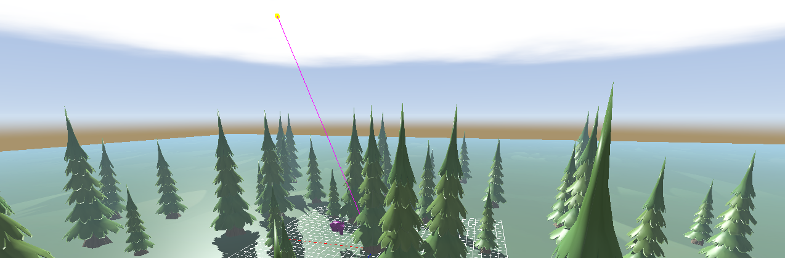

#+HUGO_BASE_DIR: ../
#+HUGO_SECTION: ./
#+HUGO_MENU: :menu main :weight 1
#+EXPORT_FILE_NAME: _index
#+TITLE: Home

#+begin_center
#+attr_html: :class avatar :width 200px
[[/images/avatar.jpeg]]
#+end_center

Hi, I'm Zak 👋🏼

An aspiring software engineer passionate about low-level programming and
high-performance design. I specialise in C and C++ with experience in Python as
well. My main interests include Computer Graphics, Rendering Engine
Architecture, and Systems Programming, where I focus on building efficient
software from first principles.

Currently, based in London where I work at [[https://sonyinteractive.com/en/][Sony Interactive Entertainment Europe]]
(SIEE) within the Advanced Technology Group (ATG) developing core systems for
the PlayStation platform.

Previously graduated with a distinction in [[https://study.ed.ac.uk/programmes/postgraduate-taught/187-high-performance-computing][High-Performance Computing]] (M.Sc.)
from the [[https://www.ed.ac.uk][University of Edinburgh]]. For further details you can view my [[file:/Zakariya_Oulhadj_CV.pdf][CV]].

Full time Linux user running Debian with my main editor of choice for
programming being [[https://www.gnu.org/software/emacs/][Emacs]]. My dotfiles are available on GitHub [[https://github.com/ZOulhadj/dotfiles][here]].

* Skills
- *Operating Systems*: Linux, Windows, macOS
- *Programming Languages*: C, C++, Zig, Python, GLSL, HLSL
- *APIs*: Win32, OpenGL 4.6, Vulkan 1.3, MPI, OpenMP
- *Tools*: GDB, RenderDoc, Intel VTune, AMD uProf, CrayPat, Scalasca, Linaro Forge
- *Interests*: Rendering Engine Architecture, Performance Benchmarking and
  Optimisation, Network Attached Storages (Synology)

* Current Project
A real-time cross-platform rendering engine in Zig aiming to support multiple
rendering backends (OpenGL, Vulkan, D3D12, Metal) through a custom render
command system.

* Hobbies

[[/images/about.jpg]]
