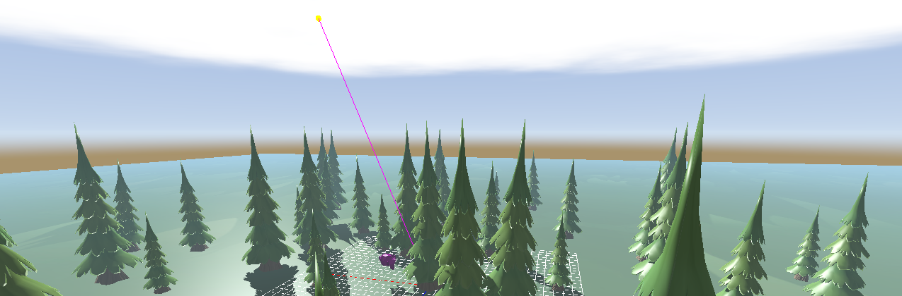

#+HUGO_BASE_DIR: ../
#+HUGO_SECTION: about
#+EXPORT_FILE_NAME: _index
#+TITLE: About

Hi, I'm Zakariya Oulhadj (Zak) 👋🏼

An aspiring software engineer passionate about low-level programming and
high-performance design. I specialise in C and C++ with experience in Python as
well. My main interests include Computer Graphics, Rendering Engine
Architecture, and Systems Programming, where I focus on building efficient
software from first principles.

Recently graduated with a distinction in High-Performance Computing (M.Sc.) from
the [[https://www.ed.ac.uk][University of Edinburgh]] and currently based in London, UK. For further
details you can view my [[file:/Zakariya_Oulhadj_CV.pdf][CV]].

Full time Linux user running Debian with my main editor of choice for
programming being [[https://www.gnu.org/software/emacs/][Emacs]]. My dotfiles are available on GitHub [[https://github.com/ZOulhadj/dotfiles][here]].

* Skills
- *Operating Systems*: Linux, Windows, macOS
- *Programming Languages*: C11, C++23, Zig, Python, GLSL, HLSL
- *APIs*: Win32, OpenGL 4.6, Vulkan 1.3, MPI, OpenMP
- *Tools*: GDB, RenderDoc, Intel VTune, CrayPat, Scalasca, Linaro Forge
- *Interests*: Rendering Engine Architecture, Performance Benchmarking and
  Optimisation, Network Attached Storages (Synology)

* Current Project
A real-time cross-platform rendering engine in C and Zig aiming to support
multiple rendering backends (OpenGL, Vulkan, D3D12) through a custom render
command system.

* Hobbies

[[/images/about.jpg]]

Check out my [[https://instagram.com/zoulhadj][Instagram]] for non-technical related content.
