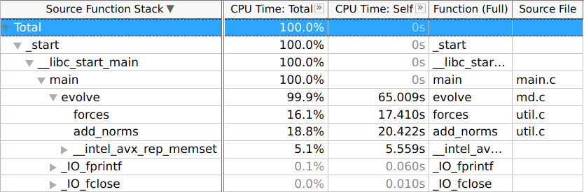
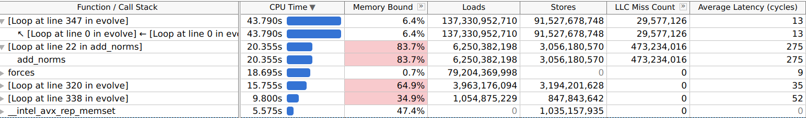
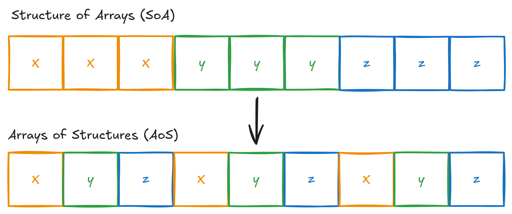
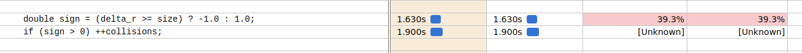
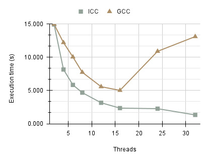
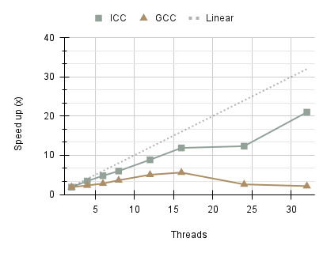
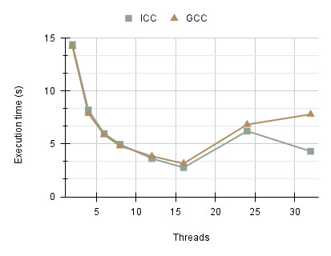
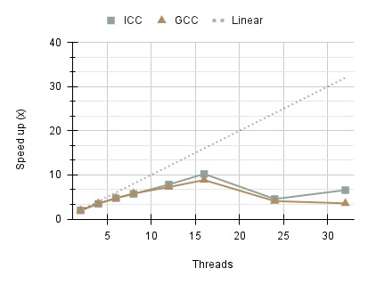
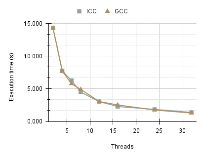
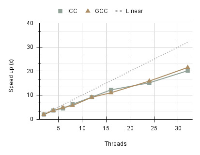

#+HUGO_BASE_DIR: ../
#+HUGO_SECTION: posts
#+AUTHOR: Zakariya Oulhadj
#+PROPERTY: header-args :exports code

* Why I prefer C instead of C++                                       :c:cpp:
:PROPERTIES:
:EXPORT_FILE_NAME: why-c-over-cpp
:EXPORT_DATE: 2026-10-10
:END:

*Disclaimer*: This blog post is meant to be a light hearted rant/discussion on
some of C++'s pitfalls and is highly opinionated. I'm sure many will attempt to
find flaws in my arguments so take everything with a grain of salt. End of the
day, you can program in any language you like, just remember to keep things
simple.

** Background

My journey of learning to program started with C++.

Having been exposed to C++ for over 5 years, my thinking slowly started to
shift. I started to realise that after all these years my knowledge of C++
whilst decent I'd say I always felt that I didn't know everything.

Over the years, through my own research I stumbled across a wide range of
resources

my never ending on [[https://en.cppreference.com/index.html][cppreference]]

The following people are well known within the game development community and
are considered highly experienced programmers. It is they who have significantly
influenced my way of thinking about code and programming style:

- [[https://en.wikipedia.org/wiki/Casey_Muratori][Casey Muratori]] (Handmade Hero)
- [[https://en.wikipedia.org/wiki/Jonathan_Blow][Johnathan Blow]] (CEO of Thekla Inc. and creator of Braid and The Witness)
- Sean Barret (Author of [[https://github.com/nothings/stb][STB]] libraries)
- Ryan Fluerer (Author of RAD Debugger)
- Eskil Steenberg (YouTuber?)
- Shawn McGrath (Game developer?)

It was only after I discovered Casey Muratori and his Handmade Hero series in
which he develops his own game from scratch that opened my eyes to a different
way of thinking about and writing code.

Ever since I started, I have always been exposed to C++ and object-oriented
programming which has been presented as this holy grail and taught that the
"correct" and clean way to write code was.

Uncle Bob vs Casey Muratori Clean Code Q&A
https://github.com/unclebob/cmuratori-discussion

#+CAPTION: Casey Muratori, "Handmade Hero | Getting rid of the OOP mindset" [00:02:28]
#+BEGIN_QUOTE
"Is the pixel an object or is it a group of objects? Is there a container? Do I
have to ask a factory to get me a color?"
#+END_QUOTE
[[https://youtu.be/GKYCA3UsmrU?t=140][Source: Getting rid of the OOP mindset]]

I'm certaintly not the first and will not be the last when it comes to critising
C++.

When being taught how to program for the first time, students are often
introduced to C first in order to teach them about memory, allocations,
pointers. It's not long, however, until they move onto to learning C++  C

[[https://youtu.be/C90H3ZueZMM?si=BYGETZNMBqVTmDd9&t=926][Why OOP Is A Nightmare]]

** The Paradox of Choice: The Real Cost of "Flexibility"
C++ programmers often cite the language's vast feature set as its primary
strength, offering the "flexibility" to solve any problem. In reality, this
flexibility is a double-edged sword due to decades of questionable design
decisions and a committee's rigid adherence to backwards compatibility. The
result is a language that has become a "kitchen sink" of abstractions, imposing
a constant, draining *cognitive load* on the developer.

This is the *Paradox of Choice* applied to systems programming: when a language
provides ten different ways to initialize a single variable or pass a piece of
data, it forces the programmer to expend finite mental energy on the how rather
than the what. Instead of focusing on the actual problem, you are trapped in a
cycle of micro-evaluations—weighing "modern" best practices against "legacy"
realities.

Consider a simple analogy: shopping at a hypermarket with fifty aisles of
cereal. You only need a basic meal, yet you are forced to navigate endless
variations, marketing claims, and "modern" vs. "legacy" packaging. By the time
you reach the checkout, you are experiencing Analysis Paralysis. You have
exhausted your mental capital on a trivial choice, leaving you with less focus
for the rest of your day.

C++ is that hypermarket. Every line of code requires a series of
micro-decisions: Should this be a template? Is a virtual destructor necessary
here? Am I using the 'modern' C++20 way or the 'safe' C++11 way? This creates a
culture of bikeshedding and internal debate that has nothing to do with the
machine or the end user. It is a slow accumulation of "choice fatigue" that
makes a codebase feel heavy and unpredictable.

Don't take my word for it. Lets take a look at of all the main ways we can
initialize a variable in C++ (as of writing).
#+BEGIN_SRC cpp
  int basic = 10;             // 1. C-style copy initialization
  int direct(10);             // 2. Functional/Constructor style
  int brace{10};              // 3. Uniform initialization (C++11) - Prevents narrowing
  int list = {10};            // 4. Copy list initialization (C++11)
  int value_init{};           // 5. Value initialization (Zeroes the memory)

  auto deduced = 10;          // 6. Type deduction (C++11)
  auto braced_deduce{10};     // 7. Direct braced deduction (C++17)

  // The "Trap": These look similar but result in different types
  auto x = 10;                // x is an int
  auto y{10};                 // y is an int
  auto z = {10};              // z is a std::initializer_list<int> !!

  // C++20 Designated Initializers (Borrowed from C, but with more rules)
  struct Point { int x, y; };
  Point p = {.x = 1, .y = 2};
#+END_SRC

(Copy Elision C++17) - Look into this

Not sure about you, but personally...? That's just confusing and uneccesarily
complicated for simply just assigning a single value to a variable.

C, by contrast, functions like a small local shop. It provides a limited set of
tools that have remained largely unchanged for decades. There is no "perfect"
abstraction for every niche scenario, but there is also no choice to be made.
You pick up the tool, you apply it to the hardware, and you move on. In C, the
constraints are a pragmatic mercy; they remove the burden of the language
itself, allowing you to focus entirely on the logic of your program.

The purpose of this post is to give my personal experience of the two languages
and why I choose to use C for most projects.

- Templates
- Overloading (Unpredictable code flow)
- Inheritence (links to context)
- WYSIWYG (No hidden function calls or other side effects)
- Context (Needing to understand large parts of a code base)

** Overloading

#+BEGIN_SRC cpp
  int add(int a, int b);       // (A) Integer version
  int add(float a, float b);   // (B) Float version
  int add(double a, double b); // (C) Double version

  add(5, 10);                  // Calls (A): Exact match
  add(2.0, 1.0);               // Calls (C): Exact match

  // We can't be sure which overload gets called...
  add(2.0f, 10);               // Error: Ambigious: (A) or (B) ?
  add(5, 5.0);                 // Error: Ambigious: (A) or (C) ?
#+END_SRC

Whilst this will fail to build as a C++ compiler recognises the ambigiouity, the
point is that we as programmers need to understand the types and order to even
know which function may be called. This becomes increasingly tricky in larger
code bases and lots of different function names.

If we compare this to a C version we get the following which makes all function
calls explicit:
#+BEGIN_SRC c
  int addi(int a, int b);       // (A) Integer version
  int addf(float a, float b);   // (B) Float version
  int addd(double a, double b); // (C) Double version

  addi(10, 20);                 // "i" for integer
  addf(10, 20);                 // "f" for float
  addd(10, 20);                 // "d" for double
#+END_SRC

A side benfit to having each function be unqiue is that we can easily grep for
the specific one we are looking for which makes searching a codebase
significantly easier.

Take the following example which performs an operation between two vectors
src_cpp{vec_b} and src_cpp{vec_c} and stores the result in src_cpp{vec_a}. A
challenge to the reader: Is this a pairwise multiplication or a dot product?
#+BEGIN_SRC cpp
  // C++ - Is this mul or dot? We must now check overloaded operator to find
  // out...
  vec_a = vec_b * vec_c;

  // C - Explicit functions clearly defines operation
  vector_mul(vec_a, vec_b, vec_c);
  vector_dot(vec_a, vec_b, vec_c);
#+END_SRC

Some argue that this is simply 'bad API design' rather than a flaw of C++.
However, C++ is the only language of the two that permits and encourages this
ambiguity. By allowing the programmer to hide complex, potentially heavy math
operations behind a simple * operator, C++ prioritizes 'math-like' syntax over
engineering clarity. In C, you don't have the option to be ambiguous with
operators. You must name the operation, which forces clarity by default.

A few times I wanted out to out of mere interest to look at the Linux source
code

Whilst I do admit my knowelege of operating systems is very little I did have
this sudden realisation the code I was looking at whilst I did not understand
from a larger context, the specific lines of code were easy to understand

Having said all this, you may come to the conclusion that all this is a skill
issue. This very well may be the case, and I never claimed to be the best
programmer in fact I'd argue the opposite but I rest my case.

** Inheritence (links to context)

** Code Flow

When reading a book we are not expected to constantly be jumping

** Templates
Out of all C++ language features, templates has to be by far the number one
reason that made be ultimetly switch to C. From not knowing the underlying type
(by definition), significantly longer compile times and larger executables.

There is this infamous [[http://archive.md/2014.04.28-125041/http://www.boost.org/doc/libs/1_55_0/libs/geometry/doc/html/geometry/design.html][post]] from the [[https://www.boost.org/][Boost]] C++ library which takes a simple,
easy to reason about src_c{distance} function that calculates the Euclidean
distance between two points and turns it into a over-engineered templated mess,
enabled by C++.

Before:
#+BEGIN_SRC cpp
  // Simple, easy to understand code where we can see what the CPU is doing.
  double distance(struct point *a, struct point *b) {
      double dx = a->x - b->x;
      double dy = a->y - b->y;

      return sqrt(dx * dx + dy * dy);
  }
#+END_SRC

After:
#+BEGIN_SRC cpp
  // Now we have geometric objects, dispatching, tag dispatching, different
  // strategies
  template <typename G1, typename G2, typename S>
  double distance(G1 const& g1, G2 const& g2, S const& strategy) {
      return dispatch::distance<typename tag<G1>::type,
                                typename tag<G2>::type,
                                G1,
                                G2,
                                S>::apply(g1, g2, strategy);
  }
#+END_SRC

The transparency of the original function is sacrificed for a generic
abstraction that provides no immediate clarity. We've traded a five-line
Euclidean formula for a riddle of template parameters. Does src_c{::apply}
eventually subtract src_c{x} from src_c{y}? Probably, but you’ll have to dig
through layers of Boost's "dispatch" logic just to be sure.

Let's take a look at a more extreme example. [[https://github.com/skypjack/entt/][EnTT]] is a highly popular ECS
(Entity Component System) library. The library itself is great and so I am not
attempting to bash the library but rather use it as a case study in regards to
code readability. There is a specific function src_c{group} which according to
the library wiki:
#+BEGIN_QUOTE
Groups are meant to iterate multiple components at once and to offer a faster
alternative to multi type views.
#+END_QUOTE

The implementation details is not important. If you can understand the code
below then hats off but personally I still struggle to fully understand it. Is
this a *skill issue*? Maybe, but even so, to understand what this code is doing we
need to first understand templates, variadic expansion, compile-time branching,
fold expressions, etc. All of which distract us from what the code is actually
attempting to do which is merely to perform a cache lookup for an existing
component grouping or, if none exists, allocate and initialize a new one.

#+BEGIN_SRC cpp
  template<typename... Owned, typename... Get, typename... Exclude>
  basic_group<owned_t<storage_for_type<Owned>...>,
              get_t<storage_for_type<Get>...>,
              exclude_t<storage_for_type<Exclude>...>>
  group(get_t<Get...> = get_t{}, exclude_t<Exclude...> = exclude_t{}) {
      using group_type = basic_group<owned_t<storage_for_type<Owned>...>,
                                     get_t<storage_for_type<Get>...>,
                                     exclude_t<storage_for_type<Exclude>...>>;
      using handler_type = typename group_type::handler;

      if (auto it = groups.find(group_type::group_id()); it != groups.cend()) {
          return {*std::static_pointer_cast<handler_type>(it->second)};
      }

      std::shared_ptr<handler_type> handler{};
      if constexpr (sizeof...(Owned) == 0u) {
          handler = std::allocate_shared<handler_type>(get_allocator(),
                                                       get_allocator(),
                                                       std::forward_as_tuple(assure<std::remove_const_t<Get>>()...),
                                                       std::forward_as_tuple(assure<std::remove_const_t<Exclude>>()...));
      } else {
          handler = std::allocate_shared<handler_type>(get_allocator(),
                                                       std::forward_as_tuple(assure<std::remove_const_t<Owned>>()...,
                                                                             assure<std::remove_const_t<Get>>()...),
                                                       std::forward_as_tuple(assure<std::remove_const_t<Exclude>>()...));
          ENTT_ASSERT(std::all_of(groups.cbegin(), groups.cend(),  {
              return !(data.second->owned(type_id<Owned>().hash()) || ...);
          }), "Conflicting groups");
      }

      groups.emplace(group_type::group_id(), handler);

      return {*handler};
  }
#+END_SRC

I am sure this code has been extensively tested and is highly optimised,
however, from the point of view of a programmer its a nightmare. This has poor
readability, high cognitive load and requires large amount of outside context to
understand.

** Context
- WYSIWYG (No hidden function calls or other side effects)
- Context (Needing to understand large parts of a code base)

** Cognitive Load
With all this being said, I believe this all comes down to the simple principle
of congitive load and clarity. As programmers, we want to focus and solve the
actual problem at hand. Wether thats implementing new functionaility, debugging
existing code etc. We do not want to have to constantly fight the language
itself

** Final Thoughts
Ultimately, this all comes down to

A quote that I think best explains is phomenon:

A quote from Terry Davis, Creator of Temple OS (Full quote [[https://www.goodreads.com/quotes/10480697-an-idiot-admires-complexity-a-genius-admires-simplicity-a-physicist][here]]):
#+BEGIN_QUOTE
An idiot admires complexity, a genius admires simplicity
#+END_QUOTE

If you must use C++, I'd suggest you take a look at [[https://bkaradzic.github.io/posts/orthodoxc++/][Orthodox C++]] which is
according to the blog post:
#+BEGIN_QUOTE
Orthodox C++ (sometimes referred as C+) is minimal subset of C++ that improves
C, but avoids all unnecessary things from so called Modern C++.
#+END_QUOTE

* Optimising a Molecular Dynamics Application                 :c:hpc:masters:
:PROPERTIES:
:EXPORT_FILE_NAME: optimising-molecular-dynamics
:EXPORT_DATE: 2025-04-04
:END:

/The full source code is available on [[https://github.com/ZOulhadj/performance-programming][GitHub]]./

** Problem Statement
The second part of the Performance Programming module ([[http://www.drps.ed.ac.uk/24-25/dpt/cxepcc11009.htm][EPCC11009]]), was to
manually optimise a C-based molecular dynamics simulation code. The project
required the transformation of a suboptimal legacy codebase into a
high-performance solution, prioritising runtime reduction without compromising
the integrity of the simulation results. A key restriction imposed by the
project was that all optimisations must be done using a single thread i.e no
multi-threading.

** Hardware and Tools

The project was conducted on the Cirrus UK Tier-2 HPC service, utilizing a
single standard compute node. The node is powered by dual 18-core Intel Xeon
E5-2695 v4 (Broadwell) processors running at 2.1GHz, providing a total of 36
physical cores and 72 hardware threads backed by 256GB of shared memory.

To contextualize the optimization strategy, it is important to note the cache
topology: each core possesses a private 64KiB L1 cache (split evenly between
instructions and data) and a 256KiB L2 cache, while the sockets feature a
substantial 45MiB shared L3 cache.

** Compilation

The Intel oneAPI compiler (version 2024.0.2) was used (provided by src_c{oneapi}
and src_c{compiler/2024.0.2} Lmod modules on Cirrus), as it delivered the best
performance in a previous investigation using the compiler flags shown below.
These flags are, therefore, used for compiling the code using src_c{-std=c11},
targeting the Intel Broadwell architecture with the optimisation level
src_c{-O3}. Additionally, the program is configured to run solely on a single
thread as the code modifications focused on improving the serial performance.

#+BEGIN_SRC text
icx -Wall -axBROADWELL -march=broadwell -mtune=broadwell -O3 -ipo -qoverride -limits
#+END_SRC

** Correctness Testing
The application was executed on Cirrus using the Slurm workload manager
(v22.05.11). Performance analysis was conducted with Intel VTune 2024.0.0
(vtune/2024.0) and gprof v2.30-93.el8, while memory analysis was performed using
Valgrind v3.22.0. Each test was conducted three times, with the average and
standard deviations recorded to ensure consistency and accuracy in the results.
Additionally, correctness was verified using the src_c{diff-output} tool
provided as part of the code to ensure the generated src_c{output.dat} files
contained values below the 0.001 threshold. The program was further extended to
detect src_c{NaN} values using the src_c{isnan} function from the C standard
library.

** Preliminary Performance Analysis
Previous optimisation work established a baseline runtime of 64.493 seconds
using the unmodified source code and specific compiler flags. However, initial
replication attempts yielded an unexpected regression to 74.342 seconds (a ~10s
increase). This discrepancy was traced to a system update on Cirrus, where the
default Intel compiler had shifted from ICX 2024.0.2 to 2025.0.4. The newer
version proved less efficient with the established flag configuration. To ensure
a consistent baseline, the environment was explicitly pinned to the
compiler/2024.0.2 module, which restored the expected runtime.

Prior to manual optimisation, the application was profiled using a 4096-particle
simulation. The src_c{-fno-inline} flag was applied alongside src_c{-O3} to
preserve the call graph structure during analysis. VTune Hotspot analysis
identified the src_c{evolve} function as the primary bottleneck, consuming 99.9%
of total execution time. Within evolve, the functions src_c{forces},
src_c{add_norms}, and src_c{__intel_avx_rep_memset} accounted for 43.391s.

Memory usage and access patterns were also analysed
(src_c{-collect-memory-access}). The results obtained, as shown below, indicate
the primary performance bottleneck can be attributed to memory-bound operations.
Specifically, the src_c{add_norms} function reported being 83.7% memory-bound,
with a last-level cache miss rate of 94.1% (473,234,016 misses) and an average
access latency of 275 cycles, resulting in 20.355 seconds spent within that
function. Additionally, the code that calculates pairwise forces accounts for
43.790 seconds of the total runtime. Although the profiler did not explicitly
identify this section as memory-bound, the likely causes may still be
inefficiencies related to memory access patterns and the src_c{pow} function,
which can be computationally expensive if the compiler cannot optimise it
effectively.

Valgrind was also used to identify issues related to memory allocation. Running
the program with the src_c{-ggdb3} flag, revealed that a total of 608MB
(637,960,192 bytes) were allocated across 9 blocks. The output indicated that
none of these blocks, allocated through calloc, were freed before the program
terminated, resulting in memory leaks.

#+BEGIN_SRC text
  valgrind --leak -check=full --show -leak -kinds=all --track -origins=yes
  --verbose ./ build/md
#+END_SRC

** Code Optimisations
Based on the performance results obtained through profiling, this section
presents several recommendations for code modifications to enhance the program's
performance. The optimisations focus on the src_c{evolve} function, aiming to
minimise unnecessary loop iterations, improve memory access efficiency, simplify
calculations, and reduce the overall memory footprint.

*** Loop Fusion
Loop fusion involves merging independent loops to reduce the total number of
iterations. The src_c{evolve} function contains 20 for-loops, many of which can
be fused. This optimisation not only decreases the number of executed iterations
but also enhances compiler optimisation opportunities, improving overall
performance. The first recommendation is for the viscosity and wind terms, as
well as the central mass distance to be combined. This is possible as each
function iterates over src_c{Ndim} times with this initial fusing of loops shown
below. Furthermore, instead of setting each value to zero for the r array, this
can be replaced with a call to src_c{memset} before the first loop.

#+BEGIN_SRC c
  memset(r, 0, sizeof(double) * Nbody);
  for (int i = 0; i < Ndim; ++i) {
      vis_forces(Nbody , f[i], vis , velo[i]);
      wind_forces(Nbody , f[i], vis , wind[i]);
      add_norms(Nbody , r, pos[i]);
  }
#+END_SRC

Each function separately loops over the src_c{Nbody} array, which can be avoided
by extracting the code of each function out directly into the src_c{evolve}
function, reducing the src_c{Nbody} iteration count by a third.
#+BEGIN_SRC c
  memset(r, 0, sizeof(double) * Nbody);
  for (int i = 0; i < Ndim; ++i) {
      for (int j = 0; j < Nbody; ++j) {
          f[i][j] = -vis[j] * velo[i][j];       // vis_forces()
          f[i][j] = f[i][j] - vis[j] * wind[i]; // wind_forces()
          r[j] += (pos[i][j] * pos[i][j]);      // add_norms()
      }
  }
#+END_SRC

At this stage, it was observed that looping over each dimension individually
made it challenging to fuse loops due to dependencies such as the use of
src_c{sqrt} and the addition of pairwise forces. To address this, rather than
iterating over each particle dimension separately, the loops were restructured
to process entire particles i.e x, y, z in one go. The result of this
transformation, eliminates the need for memset and allows the central force
calculation to be combined into the force calculation loop.

/Whilst this is initially inefficient, we later change the memory layout of
particles to better align with our accesses./

#+BEGIN_SRC c
  for (int i = 0; i < Nbody; ++i) {
      f[0][i] = -vis[i] * velo [0][i];       // viscosity
      f[0][i] = f[0][i] - vis[i] * wind [0]; // wind
      // X and Y here ...

      r[i] = 0.0;
      r[i] += (pos [0][i] * pos [0][i]);
      r[i] += (pos [1][i] * pos [1][i]);
      r[i] += (pos [2][i] * pos [2][i]);
      r[i] = sqrt(r[i]);

      f[0][i] -= forces(G * mass[i] * M_central , pos [0][i], r[i]);
      f[1][i] -= forces(G * mass[i] * M_central , pos [1][i], r[i]);
      f[2][i] -= forces(G * mass[i] * M_central , pos [2][i], r[i]);
  }
#+END_SRC

With this change in place, further analysis revealed that calculating the
pairwise and normalised separation vector can be fused into the pairwise
addition directly. This is due to src_c{Npair} loop that iterates over particle
pairs being identical to that of the inner for-loop of the adding of pairwise
forces src_c{int j = i + 1; j < Nbody; ++j}. Therefore, the src_c{Npair} loop can
be removed and placed in the innermost loop, resulting in fewer additional
iterations needed.

#+BEGIN_SRC c
  int k = 0;
  for (int i = 0; i < Nbody; ++i) {
      for (int j = i + 1; j < Nbody; ++j) {
          // For separation for each dimension
          delta_pos [0][k] = pos [0][i] - pos [0][j];
          delta_pos [1][k] = pos [1][i] - pos [1][j];
          delta_pos [2][k] = pos [2][i] - pos [2][j];

          // Squared norm calculation
          delta_r[k] = 0.0;
          delta_r[k] += (delta_pos [0][k] * delta_pos [0][k]);
          delta_r[k] += (delta_pos [1][k] * delta_pos [1][k]);
          delta_r[k] += (delta_pos [2][k] * delta_pos [2][k]);
          delta_r[k] = sqrt(delta_r[k]);

          // Flip forces ...
          if (delta_r[k] >= size) {
              ...
#+END_SRC

The last loop fusion that can be applied is at the end of the evolve function,
where the position and velocity can also be combined.

#+BEGIN_SRC c
  for (int i = 0; i < Nbody; ++i) {
      for (int j = 0; j < Ndim; ++j) {
          pos[j][i] += dt * velo[j][i];
          velo[j][i] += dt * (f[j][i] / mass[i]);
      }
  }
#+END_SRC

*** Loop Interchange
Loop interchange refers to reordering nested loops to enhance cache locality.
During initialisation, arrays are allocated as a contiguous one dimensional
block of memory, with the particle layout illustrated below. This arrangement
follows the Structure of Arrays (SOA) approach, storing each component
continuously within a single buffer. Several loops in the original evolve
function iterate over loops in column-major order, which results in poor cache
usage. These are swapped so that memory accesses are instead in row-major order.
It is important to note, however, that this is an intermediate step as the
memory layout is later changed to an Array of Structures (AOS).

The loops that calculates the central force, can be swapped so that accesses
into the src_c{f} and src_c{pos} arrays are continuous in memory.
#+BEGIN_SRC c
  for (int i = 0; i < Ndim; ++i) {
      for (int j = 0; j < Nbody; ++j) {
          f[i][j] -= forces(G * mass[j] * M_central , pos[i][j], r[j]);
      }
  }
#+END_SRC

This can also be applied to the updating of positions and velocities:
#+BEGIN_SRC c
  for (int i = 0; i < Ndim; ++i) {
      for (int j = 0; j < Nbody; ++j) {
          pos[i][j] += dt * velo[i][j];
          velo[i][j] += dt * (f[i][j] / mass[j]);
      }
  }
#+END_SRC

*** Algebraic Simplification
The code’s performance and readability can be substantially improved by performing algebraic
simplification. Firstly, the code shown previously:

#+BEGIN_SRC c
  f[i][j] = -vis[j] * velo[i][j];       // vis_forces()
  f[i][j] = f[i][j] - vis[j] * wind[i]; // wind_forces()
  r[j] += (pos[i][j] * pos[i][j]);      // add_norms()
#+END_SRC

can be simplified by combining the viscosity and wind terms into a single
equation by applying the distributive property of multiplication: $ a \cdot b +
a \cdot c = a \cdot (b+c) $.

$ \vec{F} = -u \cdot \vec{V} = -u \cdot (\vec{v} + \vec{w}) $

where $ u $ is the viscosity and $ V $ is the effective velocity vector, the
combination of velocity $ v $ and wind vector $ w $. Additionally, this
simplification more directly maps to a Fused Multiply-Add (FMA) instruction,
enabling supported hardware to compute each component force in a single
instruction.

#+BEGIN_SRC c
  f[i][j] = -vis[j] * (velo[i][j] + wind[i]);
#+END_SRC

Next, as the central mass distance calculation is fully fused, the r array is
now redundant as this is the only location where this is calculated. Therefore,
this can be changed to be entirely on the stack using a single double-precision
variable:

#+BEGIN_SRC c
  double r = sqrt(pos_x*pos_x+pos_y*pos_y+pos_z*pos_z);
#+END_SRC

As identified during profiling, the src_c{pow} function caused significant
bottlenecks, resulting in runtimes of over 20 minutes, likely due to needing to
handle raising to any power. Since the code hardcodes raising to the third
power, the src_c{forces} function for the central force calculation is extracted
and the call to the src_c{pow} function is replaced by three multiplications.
Additionally, the src_c{Wv} and src_c{r_pow_3} are cached as the values do not
change between the components.

#+BEGIN_SRC c
  // calculate central force
  double Wv = G * mass[i] * M_central;
  double r_pow_3 = r*r*r;
  f[0][i] -= Wv * pos [0][i] / r_pow_3;
  f[1][i] -= Wv * pos [1][i] / r_pow_3;
  f[2][i] -= Wv * pos [2][i] / r_pow_3;
#+END_SRC

Next, after fusing the pairwise separation and norm calculations into the
addition of pairwise forces, it was initially observed that the runtime
increased from 13 to 21.9 seconds per 100 iterations, likely due to the compiler
being unable to optimise effectively. However, these modifications highlighted
that the src_c{delta_pos} and src_c{delta_r} arrays were redundant and could be
replaced with stack-allocated five variables. By applying algebraic
simplification and eliminating unnecessary array loads and stores, the runtime
of the program was significantly reduced. Additionally, instead of diving three
times, which is substantially slower than multiplication, we can compute the
inverse once and use this precomputed value for all dimensions. Introducing the
sign variable simplifies the code substantially as the forces do not need to be
duplicated for the positive and negative forces. The updated pairwise particle
calculation reduced runtime per 100 iterations to approximately 6.4 seconds on
average.

#+BEGIN_SRC c
    double dx = pxi - pxj, dy = pyi - pyj, dz = pzi - pzj;
    double delta_r = sqrt(dx * dx + dy * dy + dz * dz);
    double size = radius[i] + radius[j];
    double Wv = G * mass[i] * mass[j];
    double inv_r3 = 1.0 / (delta_r * delta_r * delta_r);
    double F = Wv * inv_r3;
    double fx = F * dx, fy = F * dy, fz = F * dz;

    double sign = (delta_r >= size) ? -1.0 : 1.0;
    f[0][i] += sign * fx; f[0][j] -= sign * fx;
    f[1][i] += sign * fy; f[1][j] -= sign * fy;
    f[2][i] += sign * fz; f[2][j] -= sign * fz;
    if (sign > 0)
        ++collisions;
#+END_SRC

Additionally, the src_c{k} increment variable can be removed since src_c{Ndim}
is no longer used. Likewise, the src_c{hascollided} variable is unnecessary, as
collisions can be incremented directly.

*** Redundant Memory Allocations
Now that the heap-allocated src_c{r}, src_c{delta_r} and src_c{delta_pos} arrays
are no longer used, they can be removed, saving 512MB of memory when simulating
4096 particles. This shows that recalculating values on the stack can not only
significantly improve performance but also eliminate the need for redundancy
arrays and therefore, reduce memory usage. The src_c{f}, src_c{pos}, and
src_c{velo} arrays were two-dimensional, where the first index represented the
spatial dimension and the second indexed individual particles. This was
restructured into a one-dimensional allocation to eliminate an extra pointer
dereference for each load and store operation. Additionally, the memory layout
was transformed into an Array of Structures (AoS) format, interleaving particle
positions as (x1, y1, z1), (x2, y2, z2). This new structure aligns better with
the applied code optimisations, leading to a measurable performance improvement:
the average runtime for 500 iterations was reduced from 6.49 to 5.95 seconds,
equating to an improvement of approximately 0.548 seconds per 100 iterations.
The new formula for indexing can now be expressed as $ 3i + d $ where $ i $ is
the particle index ($ 0 \leq i < N $ body) and $ d $ is the dimension (1, 2, 3).

Furthermore, Valgrind's analysis conducted as part of the preliminary analysis
revealed memory leaks, prompting the addition calls to src_c{free} to ensure
that all memory allocated via src_c{calloc} is properly freed at the end of the
program.

#+BEGIN_SRC c
free(mass);
free(vis);
free(radius);
free(f);
free(pos);
free(velo);
#+END_SRC

*** Branchless Sign
Intel VTune revealed a significant portion of execution time was spent on the
two if-statements within the pairwise addition suggesting slowdowns likely as a
result of branch misprediction.

A branchless version of this can be implemented using the src_c{copysign}
function, reducing the runtime per 100 iterations from 5.94 seconds to 4.85
seconds, resulting in a total execution time of 24.34 seconds.

#+BEGIN_SRC c
double sign = copysign(1.0, size - delta_r);
collisions += (sign > 0);
#+END_SRC

** Results
After implementing numerous optimisations, the performance between the original
unoptimised and newly optimsied code is compared with particle counts ranging
from 128 to 16,384 (doubling at each step). As shown in the table below, the
runtime exhibited a superlinear increase, primarily due to growing array sizes
exceeding lower cache levels, leading to higher memory access latency. The
optimised scaling results, demonstrate significant improvements across all
particle counts. Notably, the application can now simulate four times as many
particles within roughly the same duration.

|----------------+----------------------+--------------------|
| Particle Count | Unoptimised Time (s) | Optimised Time (s) |
|----------------+----------------------+--------------------|
|            128 |               0.1068 |            0.00512 |
|            256 |               0.3238 |            0.01973 |
|            512 |               1.1180 |            0.07823 |
|           1024 |               4.2282 |            0.27985 |
|           2048 |              19.2267 |            1.09915 |
|           4096 |              77.5005 |            4.38526 |
|           8192 |             322.3570 |              16.06 |
|          16384 |            1077.3330 |              64.00 |

| Metric                |     Unoptimised |       Optimised | Improvement |
|-----------------------+-----------------+-----------------+-------------|
| Elapsed Time (s)      |          67.553 |          25.618 |      +2.64x |
| CPU Time (s)          |          64.493 |          24.205 |      +2.66x |
| Memory Bound (%)      |            34.9 |            13.2 |      +2.64x |
| L1                    |             6.8 |            18.2 |      +2.68x |
| L2                    |             2.5 |             2.3 |      +1.09x |
| L3                    |             1.6 |             0.0 |           - |
| DRAM Bound (%)        |            13.7 |             0.0 |           - |
| Store Bound (%)       |            17.1 |             0.0 |           - |
| Loads                 | 228,405,133,696 | 21,991,521, 297 |     +10.39x |
| Stores                | 100,015,973,815 |  3,206, 480,225 |     +31.19x |
| LLC Misses            |     502,811,142 |               0 |           - |
| Avg. Latency (cycles) |              20 |               9 |      +2.22x |

The final src_c{evolve} function is shown below:
#+BEGIN_SRC c
  int hit_count = 0;
  for (int step = 1; step <= count; ++step) {
      printf("timestep %d\n", step);
      printf("collisions %d\n", hit_count);

      // set the viscosity term in the force calculation
      // add the wind term in the force calculation
      for (int i = 0; i < nbody; ++i) {
          double px = pos[i].x, py = pos[i].y, pz = pos[i].z;
          double vx = velo[i].x, vy = velo[i].y, vz = velo[i].z;
          double Wv = gravity * mass[i] * central_mass;
          double r = sqrt(px*px + py*py + pz*pz);
          double r_pow_3 = r * r * r;
          double fx = -vis[i] * (vx + wind.x);
          double fy = -vis[i] * (vy + wind.y);
          double fz = -vis[i] * (vz + wind.z);
          f[i].x = fx - (Wv * px / r_pow_3);
          f[i].y = fy - (Wv * py / r_pow_3);
          f[i].z = fz - (Wv * pz / r_pow_3);
      }

      // Add pairwise forces
      for (int i = 0; i < nbody; ++i) {
          for (int j = i + 1; j < nbody; ++j) {
              double dx = pos[i].x - pos[j].x;
              double dy = pos[i].y - pos[j].y;
              double dz = pos[i].z - pos[j].z;
              double delta_r = sqrt(dx * dx + dy * dy + dz * dz);
              double size = radius[i] + radius[j];
              double Wv = gravity * mass[i] * mass[j];
              double inv_r3 = 1.0 / (delta_r * delta_r * delta_r);
              double F = Wv * inv_r3;
              double fx = F * dx , fy = F * dy , fz = F * dz;
              double sign = copysign (1.0, size - delta_r);
              hit_count += (sign > 0);
              f[i].x += sign * fx;
              f[i].y += sign * fy;
              f[i].z += sign * fz;
              f[j].x -= sign * fx;
              f[j].y -= sign * fy;
              f[j].z -= sign * fz;
          }
      }

      // update positions and velocities
      for (int i = 0; i < nbody; ++i) {
          pos[i].x += dt * velo[i].x;
          pos[i].y += dt * velo[i].y;
          pos[i].z += dt * velo[i].z;
          velo[i].x += dt * (f[i].x / mass[i]);
          velo[i].y += dt * (f[i].y / mass[i]);
          velo[i].z += dt * (f[i].z / mass[i]);
      }
  }

  *collisions = hit_count;
#+END_SRC

Additional optimisations could be implemented in the future to further reduce
the runtime including manual SIMD vectorisation as well as multi-threading with
OpenMP.

Full source code including the unoptimised and newly optimised version is
available on [[https://github.com/ZOulhadj/performance-programming][GitHub]].

# * MPI 2D Decomposed Celluar Automaton                         :c:hpc:masters:
# :PROPERTIES:
# :EXPORT_FILE_NAME: mpi-cellular-automaton
# :EXPORT_DATE: 2025-11-21
# :END:

* OpenMP Thread Queue Contention Analysis                     :c:hpc:masters:
:PROPERTIES:
:EXPORT_FILE_NAME: omp-thread-contention
:EXPORT_DATE: 2024-11-21
:END:

The full source code is available on [[https://github.com/ZOulhadj/omp-performance][GitHub]].

** Problem Statement

We were provided with two codes which implement the same algorithm in two
different ways. The algorithm is an adaptive quadrature method that computes the
integral of a function on a closed interval using a divide-and-conquer method.
The algorithm starts by applying two quadrature rules (3-point and 5-point
Simpson's rules) to the whole interval. If the difference between the integral
estimates from the two rules is small enough (or the interval is too short), the
result in added to the total integral estimate. If it is not small enough, the
interval is split into two equal halves, and the method is applied recursively
to each half. In the case supplied, evaluating the function requires the
solution of an ODE (ordinary differential equation) which is relatively
expensive in time.

Using this algorithm we were required to do the following tasks:

1. Create a parallel version of the code in src_c{solver1.c} using OpenMP task
   constructs.

2. Create a parallel version of the code in src_c{solver2.c} without using task
   constructs. Enclose the while loop in an OpenMP parallel region and allow all
   thethreads to enqueue and dequeue intervals from a single queue. Take care to
   synchronise the accesses to the queue correctly. Note that the termination
   condition for the while loop (an empty queue) is not sufficient in the
   parallel version, as the queue might be empty, but another thread may
   subsequently enqueue new intervals. The while loop should terminate only when
   the queue is empty and there are no intervals currently being processed.

3. Create another parallel version of the code in solver2.c where every thread
   has a separate queue. Implement a work-stealing method of your choice that
   attempts to balance the load between the threads. Pay attention to correct
   synchronisation and to the termination criterion.

4. Run all three parallel versions on src_c{1, 2, 4, 6, 8, 12, 16, 24} and
   src_c{32} threads on Cirrus using the Intel 20.4 compiler with the src_c{-O3
   -qopenmp} flags.

5. Run all three parallel versions on src_c{1, 2, 4, 6, 8, 12, 16, 24} and
   src_c{32} threads on Cirrus using the GNU 10.2 compiler with the src_c{-O3
   -fopenmp} flags.

** Solver 1 (Recursive Tasks)

The first program, Solver 1, implements the divide-and-conquer algorithm
recursively using OpenMP tasks. A parallel region is created at the root simpson
function call, executed by a single thread. During the recursive process, when
an interval is divided into two, a new task is created for each half. Before
returning from a recursive call, a taskwait directive is used to ensure that
both subtasks have finished execution.

The execution times indicate two varying performance characteristics between ICC
v20.4 (Intel C/C++ Compiler) and GCC v10.2.0 (GNU Compiler Collections). The
Intel compiler consistently outperforms GCC on all thread counts, showing strong
scalability. This can be attributed to compiler optimisations which produce more
efficient assembly instructions for the Intel Xeon E5-2695 processor used on the
Cirrus compute node. Beyond 16 threads, GCC performance deteriorates
significantly, with a sharp increase in execution time and therefore, decline in
scalability. The runtime disparity between the compilers reaches 11.776 seconds
on 32 threads. Inefficiencies in the compiler and increased overhead associated
with task creation may be the contributing factors. Further analysis was carried
out to determine whether these results were specifically isolated to GCC version
10.2.0. Versions 8.2.0 and 12.3.0 exhibited similar behaviour, suggesting that
the issue may stem from a long standing bug or inefficiency in the compiler’s
code generation. The results are also shown in terms of speed up indicating that
ICC was able to achieve the highest speed-up of 20.995x compared to GCC 2.143x
on 32 threads.

** Solver 2 (Shared Queue)

Solver 2 implements the same algorithm but utilises a LIFO (Last-In-First-Out)
queue for managing intervals. OpenMP locks were introduced to ensure thread-safe
enqueuing and dequeuing operations on the shared queue. The termination criteria
was revised to account for scenarios where the queue might be empty while
intervals are still being processed. As a result, the computation only completes
when the queue is empty and no threads remain active.

The execution times for both the ICC and GCC compilers are similar, with
standard deviations of 8.084 and 7.719 seconds, respectively. Execution times
generally decrease as the number of threads increases. However, beyond 16
threads, both compilers exhibit an increase in execution time of approximately
3.567 seconds, with performance becoming more irregular. This is attributed to
the synchronisation overhead introduced by frequent locking and unlocking of the
shared queue as threads compete for access. Consequently, the performance gains
achievable with this implementation are inherently limited by this bottleneck,
highlighting the need for alternative approaches. Another factor affecting
performance is the lack of load balancing, which results in certain threads
having more work whilst others are idle.

** Solver 2 (Separate Queues)

To address the performance limitations of using a shared queue, a second
implementation of Solver 2 was developed in which each thread maintains its own
separate queue. If the current threads queue is not empty, then an interval is
dequeued. However, if it is empty, then the thread attempts to “steal work” from
another thread for processing. Work is distributed in a round-robin fashion to
ensure load balancing, keeping the number of tasks in each thread’s queue
roughly equal. Each queue access is again synchronised using OpenMP locks.

Performance results, demonstrate a significant improvement compared to the first
Solver 2 using a single queue. The program reduces contention for queue access,
as each thread operates on its queue, leading to better scalability with larger
thread counts, aligning with Amdahl’s Law. The execution time is comparable to
that of Solver 1 using the ICC compiler. The speed up increasing sub-linearly
for both compilers, reaching a maximum of 20.174x and 21.523x for ICC and GCC
respectively on 32 threads.

